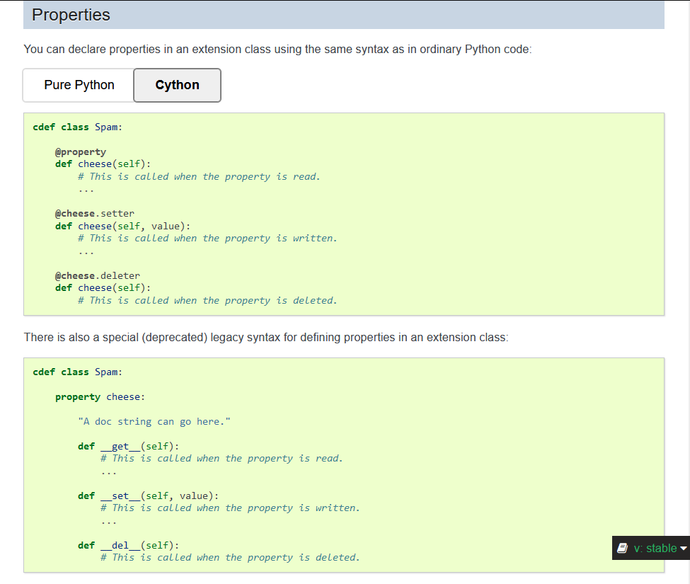

<h1 align="center">Cython Property Converter</h1>

## Convert properties in Cython extension classes from the deprecated legacy syntax to the decorator syntax. ##

<br><br>
### ===  Under construction  === ###


<br><br>
### Is this what you're trying to do? ###

https://cython.readthedocs.io/en/stable/src/userguide/extension_types.html#properties


<br><br>
### Table of Contents
* [Summary](#Summary)
* [Basic Usage](#Basic-Usage)
* [Optional Arguments](#Optional-Arguments)
* [Doc strings](#Doc-strings)
* [Requirements](#Requirements)


<br/><br/>
### Summary
Convert from this:
```
    property cheese:
        "A doc string can go here."
        def __get__(self):
            ...
        def __set__(self, value):
            ...
        def __del__(self):
            ...
```
to this:
```
    @property
    def cheese(self):
        "A doc string can go here."
        ...
    @cheese.setter
    def cheese(self, value):
        ...
    @cheese.deleter
    def cheese(self):
        ...
```


<br><br>
### Basic Usage ###
Give it a folder with the files to convert and a folder to put the new files:<br>
`python converter.py -i /path/to/files/ -o /path/to/output/`


<br><br>
### Optional Arguments ###
```
  -h, --help            show this help message and exit
  --input_dir [INPUT_DIR], -i [INPUT_DIR]
                        Path of the folder containing the files to be modified. Default: Current working directory.
  --output_dir [OUTPUT_DIR], -o [OUTPUT_DIR]
                        Path of the folder to save the modified files. Default: create a subfolder called `new_syntax` where the
                        script is located.
  --class_dec {cython,pure_python}, -c {cython,pure_python}
                        Which class declaration syntax to use. cython: `cdef class Spam:` or pure_python `@cython.cclass\nclass
                        Spam:`. Default: cython
  --output_mod_only OUTPUT_MOD_ONLY, -m OUTPUT_MOD_ONLY
                        True/False. Output all files or only modified files. Default: False (output all files)
```

<br/><br/>
### Class declaration syntax ###

Choose either Pure Python:<br>
`python converter.py --class_dec pure_python`
```
@cython.cclass
class Spam:
    @property
    def cheese(self):
        ...
```
or Cython:<br>
`python converter.py --class_dec cython`
```
cdef class Spam:
    @property
    def cheese(self):
        ...
```


<br><br>
### Doc strings ###
Since there cannot be a docstring between the decorator and the def statement, the docstrings will be moved from here:
```
    property cheese:
        "A doc string can go here."
        def __get__(self):
            ...
```
to here:
```
    @property
    def cheese(self):
        "A doc string can go here."
        ...
```


<br><br>
### Requirements ###
Compatible with indents that use spaces or tabs. However, an indent must not contain both tabs and spaces.
<br><br>

Requires Python >= 3.10.


<br><br>
